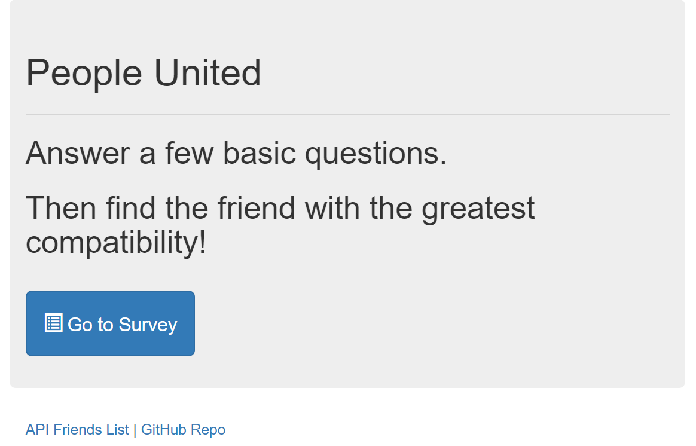
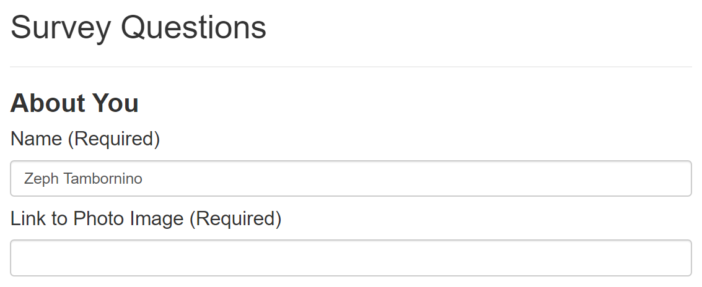
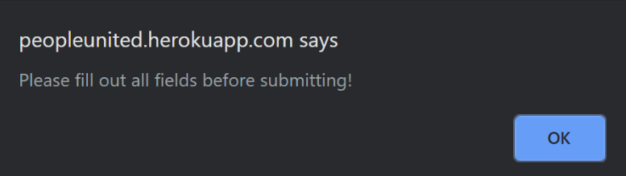
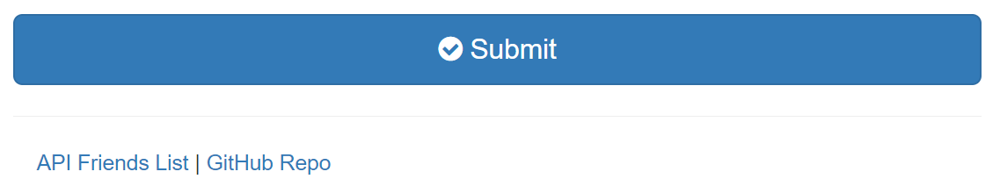
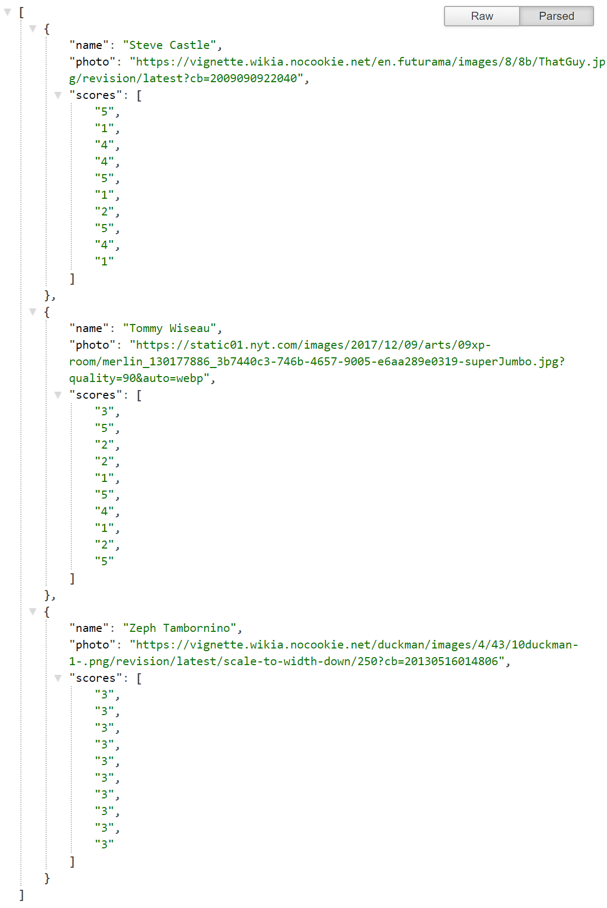

# *PeopleUnited (PU)* #
Tired of arbitrarily matching with people? Try [PeopleUnited](https://peopleunited.herokuapp.com/) 
-----------------------------------------------------

-----------------------------------------------------
### How to use: ###

After clicking the `Go to Survey` button on the homepage, make sure to fill out the required forms show below

If you don't, you'll get one of these messages

Hit the submit at the bottom of the survey to submit your data and compare it with the other friends who have filled out this survey

Finally, a box will display your best matched friend from previous user's answers to the survey

If you click `GitHub Repo` you'll return to this page, but if you click `API Friends List` you'll be taken to the following page which displays the recorded name, image url, and survey scores as such

-----------------------------------------------------
###### Created by [Zeph Tambornino](https://zefraine.github.io/My-Porfolio/) ######
